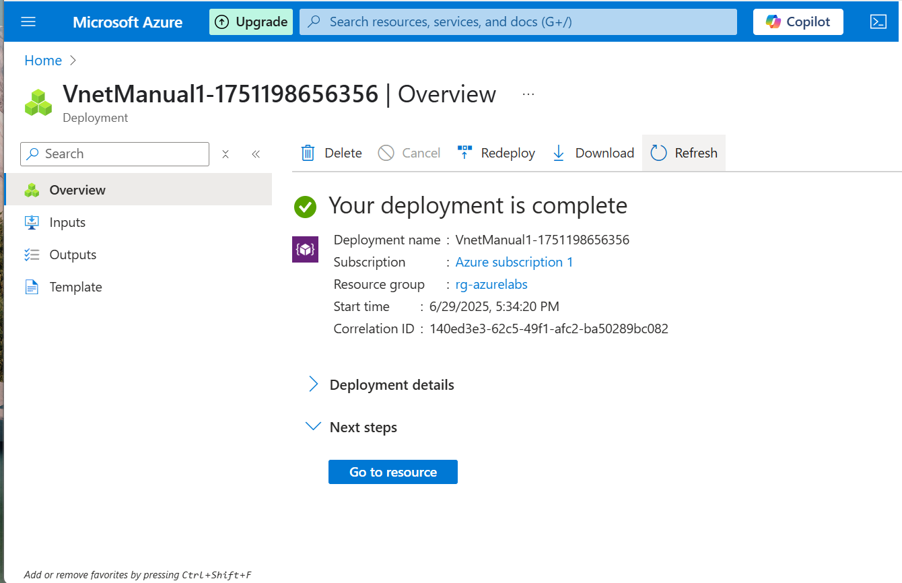

# Lab 03: Create a Virtual Network in Azure

## Objective
Create a Virtual Network and Subnet using the Azure Portal for future networking of Azure VMs.

## Steps Followed

1. Searched for "Virtual networks" → Clicked **+ Create**
2. Provided:
   - **Resource Group**: rg-azurelabs
   - **Name**: VnetManual1
   - **Region**: Central India (same as VM)
3. Set IP range:
   - **VNet**: 10.0.0.0/16
   - **Subnet**: subnet-lab03 (10.0.1.0/24)
4. Clicked Review + Create → Deployed successfully

## Screenshot(s)

## What I Learned

- The purpose of VNets and subnets in Azure
- IP range planning for private networking
- How VNets act as building blocks for communication between Azure services

## Next Step

➡️ Proceed to [Lab 04: Connect VM to VNet](../04-VM-NIC-VNet/README.md)
