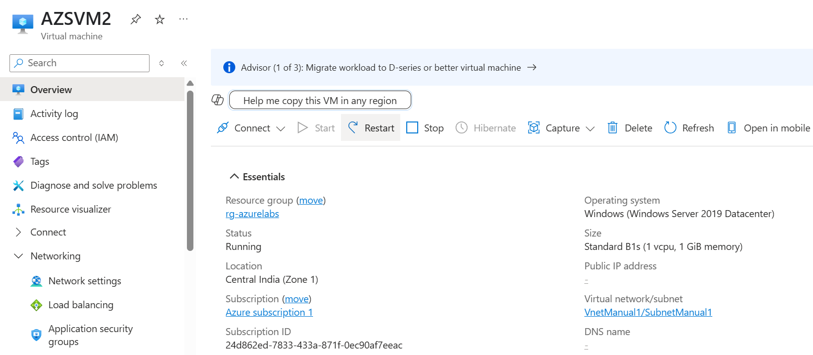
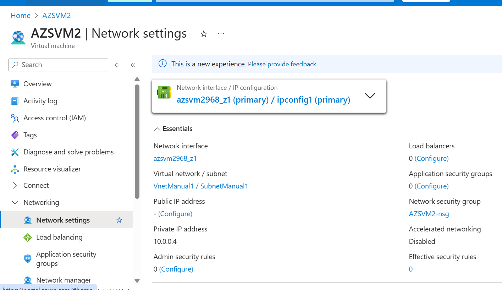

# Lab 04: Create VM in Custom VNet

## Objective
Create a VM inside the custom virtual network created in Lab 3 (`VnetManual1`) to understand network planning and VM connectivity.

## Steps Followed

1. Went to Virtual Machines → + Create
2. Used:
   - Resource Group: rg-azurelabs
   - VM Name: AZSVM2
   - Region: Central India
   - Image: Windows Server 2019
   - Size: Standard B1s
3. In the **Networking** tab:
   - VNet: VnetManual1
   - Subnet: SubnetManual1
   - Public IP: Enabled
   - RDP Port: Allowed
4. Clicked Review + Create → Created the VM successfully

## Screenshot(s)

- `vm-custom-vnet-overview.png`: VM created inside custom VNet
- `vm-networking-tab.png`: Shows VNet and Subnet attached

## What I Learned

- How to associate a VM with a custom VNet
- Networking tab configuration during VM creation
- Basics of secure access using RDP

## Next Step

➡️ Lab 05: Add a Network Security Group (NSG)
