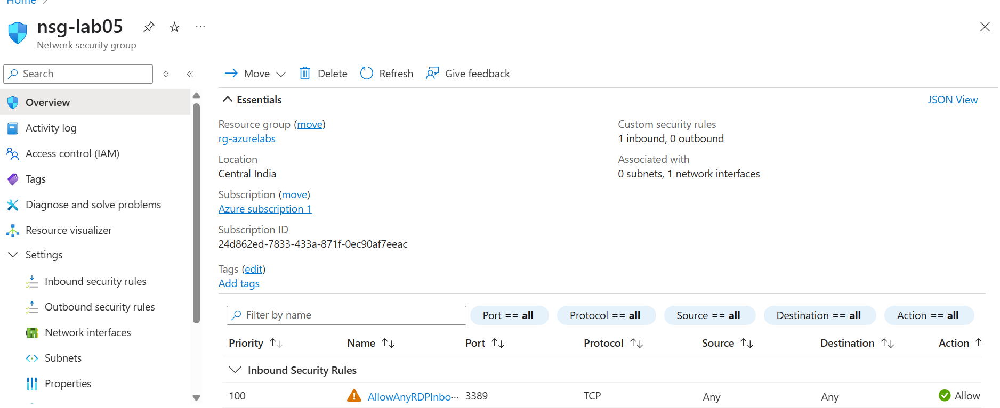
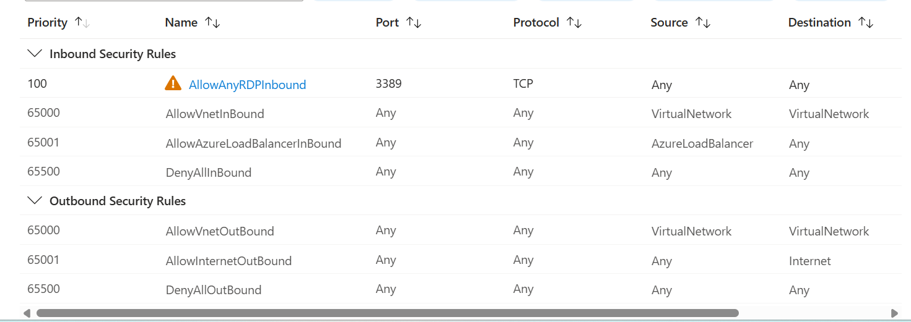
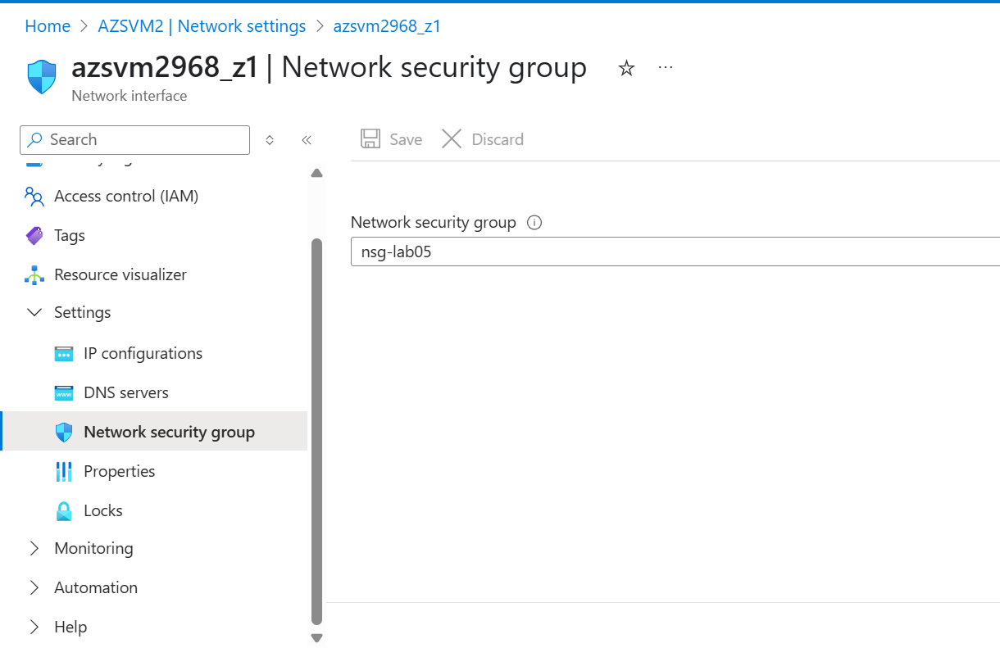

# Lab 05: Create and Associate a Network Security Group (NSG)

## Objective
To secure virtual machines using a custom NSG that controls traffic through inbound/outbound rules.

## Steps Followed

1. Created NSG `nsg-lab05` in `rg-azurelabs`
2. Added Inbound Rule:
   - Protocol: TCP
   - Port: 3389 (for RDP)
   - Action: Allow
   - Priority: 100
3. Associated NSG with:
   - NIC of VM `AZSVM2`

## Screenshot(s)

- NSG with RDP rule
- Association with NIC

## What I Learned

- How NSGs work in Azure networking
- Importance of inbound/outbound rule priority
- Securing VMs by NIC-level firewall rules

## Next Step

➡️ Lab 06: Attach a Public IP or DNS Label
