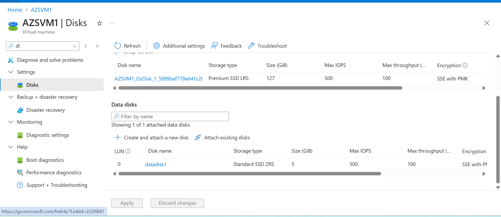
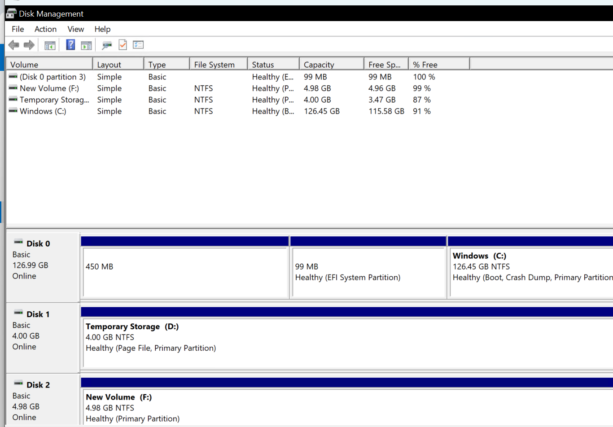
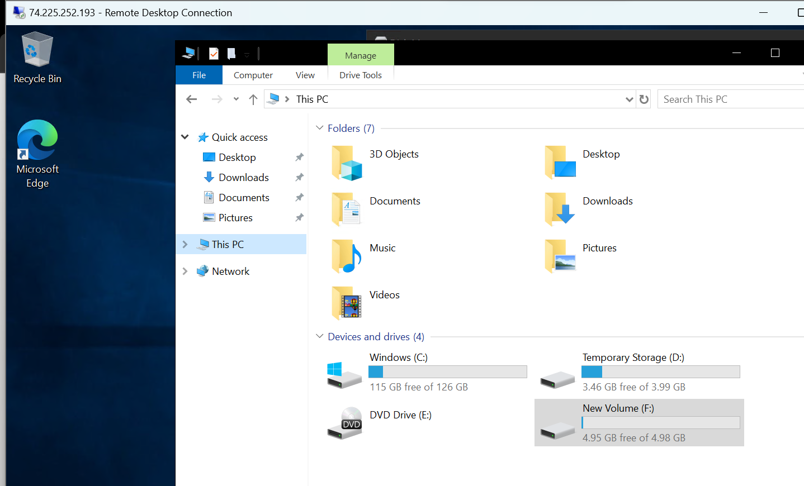

## Lab 07: Add and Format a Data Disk in Azure VM

### Objective
Attach a new data disk to an existing VM and format it inside the OS for use.

### Steps

1. Navigated to the VM `AZSVM1` > Disks.
2. Added a 5 GiB data disk named `datadisk1` with default settings.
3. Saved and updated the VM to attach the disk.
4. Connected to the VM using RDP.
5. Used `diskmgmt.msc` to initialize the disk with GPT partitioning.
6. Created a New Simple Volume, formatted it as NTFS, and assigned drive letter `F:`.
7. Verified that the new volume is visible in File Explorer.
### Screenshots

### Result
Successfully added and formatted a data disk for use inside the Windows VM.
