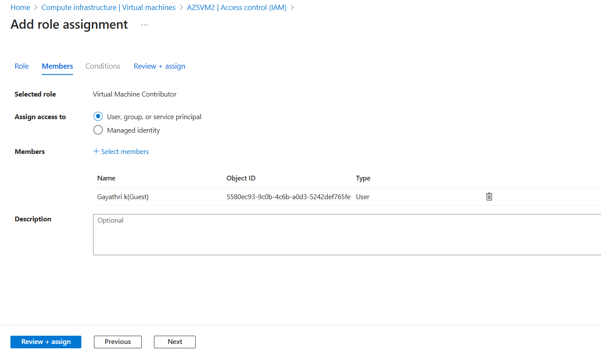
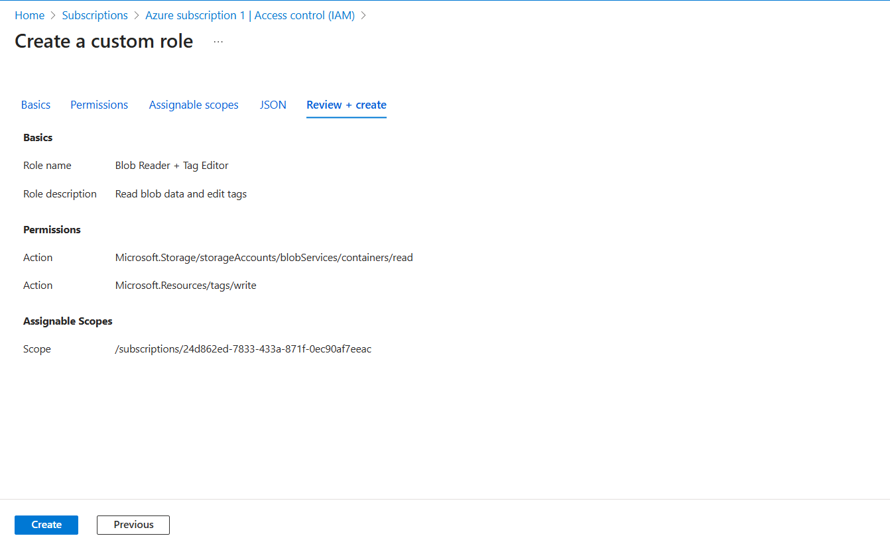

# 🔐 Azure RBAC (Role-Based Access Control) – Full Lab Guide

## 🎯 Objective
This lab demonstrates how to use **Azure Role-Based Access Control (RBAC)** to:
1. Assign built-in roles to users/groups
2. Assign roles at specific scopes (like a single VM or storage account)
3. Create and assign a **custom role** with specific permissions

---

## 📘 What is RBAC?

**RBAC (Role-Based Access Control)** is a system that helps you manage **who can access what** in Azure and what actions they can perform. It uses **roles** assigned to **principals (users, groups, or apps)** at a defined **scope** (subscription, resource group, or individual resource).

---

## 🧠 Key Components

| Term                | Description                                                                 |
|---------------------|-----------------------------------------------------------------------------|
| Role                | A set of permissions (e.g., read, write, delete)                            |
| Security Principal  | A user, group, service principal, or managed identity                       |
| Scope               | The level at which the role is applied: subscription, resource group, resource |
| Role Assignment     | Binds a role to a user/group/app at a specific scope                        |

---

## 🧪 Lab Structure

| Part | Topic                                | Description                                      |
|------|--------------------------------------|--------------------------------------------------|
| 1    | Assign Built-in Role                 | Assign a role like Reader or Contributor         |
| 2    | Assign Role at Resource Scope        | Assign permissions to a specific VM or resource  |
| 3    | Create and Assign Custom Role        | Define and use a role with custom permissions    |

---

## ✅ Part 1: Assign a Built-in Role (e.g., Reader)

### Scenario:
Give a user read-only access to a resource group named `Dev-RG`.

### Steps:
1. Go to the **Azure Portal**
2. Search and open **Resource Groups**
3. Select or create a resource group named `Dev-RG`
4. Click **Access control (IAM)** → **+ Add → Add role assignment**
5. Role: Choose `Reader`
6. Assign access to: **User, group, or service principal**
7. Select user: e.g., `devuser@yourdomain.com`
8. Click **Review + assign**

🟢 **Result**: The user can view all resources in `Dev-RG` but cannot modify or delete them.

---

## ✅ Part 2: Assign Role at Resource Scope (e.g., VM only)

### Scenario:
Allow a developer to **start/stop a VM**, but not delete or access anything else.

### Steps:
1. Go to **Virtual Machines** in Azure Portal
2. Select the VM (e.g., `Dev-VM01`)
3. Click **Access control (IAM)** → **+ Add → Add role assignment**
4. Role: Choose `Virtual Machine Contributor`
5. Select user: e.g., `devuser@yourdomain.com`
6. Click **Review + assign**

🟢 **Result**: The user can manage VM operations like start, restart, shutdown, but cannot delete or manage storage/network.

### 📌 Why Use Resource-Level Scope?
- To give **fine-grained control**
- Prevent unintended access to other resources

---

## ✅ Part 3: Create and Assign a Custom Role

### Scenario:
You want a user to:
- Read **blob data** from storage
- **Edit tags** on resources
- But **not delete or manage other settings**

---

### 🔨 Step 1: Define the Custom Role
1. Search and open **Subscriptions** → select your subscription
2. Go to **Access control (IAM)** → click **Roles** tab
3. Click **+ Add → Add custom role**
4. Provide:
   - **Name**: `Blob Reader + Tag Editor`
   - **Description**: Read blob data and edit tags

---

### ⚙️ Step 2: Add Permissions
1. Click **Permissions → + Add permissions**
2. Add:
   - `Microsoft.Storage/storageAccounts/blobServices/containers/read`
   - `Microsoft.Storage/storageAccounts/listkeys/action`
   - `Microsoft.Resources/tags/write`

---

### 📍 Step 3: Assignable Scopes
1. Choose where the role can be used:
   - Subscription (global)
   - Resource Group (e.g., `Dev-RG`)

Click **Review + Create** to save the custom role.

---

### 🎯 Step 4: Assign the Custom Role
1. Navigate to the **scope** (e.g., `Dev-RG`)
2. Go to **Access control (IAM)** → **+ Add role assignment**
3. Choose `Blob Reader + Tag Editor`
4. Select user → Click **Review + assign**

🟢 **Result**: The user can view blobs and update tags, but not manage or delete resources.

---

## 📊 Summary of Role Types

| Role Type        | Scope       | Action Permission         | Example User Use Case                   |
|------------------|-------------|----------------------------|------------------------------------------|
| **Reader**        | Resource Group | Read-only                | Auditors or monitoring users             |
| **Contributor**   | Subscription   | Create/modify (no RBAC)  | Developers                               |
| **VM Contributor**| Resource       | Manage VM                | Devs responsible for app VM              |
| **Custom Role**   | RG/Resource    | Tailored access          | Compliance officer editing tags only     |

---

## 🛡️ RBAC Best Practices

- 🔐 Use **least privilege** principle
- 🎯 Assign roles at **resource group level** unless broader access is required
- 📋 Review assignments regularly using **Azure Monitor** or **Access Reviews**
- 🛠️ Prefer **Azure AD Groups** for assigning access instead of individuals
- 🕐 Use **PIM (Privileged Identity Management)** for temporary elevation

---

## 📁 Resources

- [RBAC Overview – Microsoft Docs](https://learn.microsoft.com/en-us/azure/role-based-access-control/overview)
- [Azure Built-in Roles](https://learn.microsoft.com/en-us/azure/role-based-access-control/built-in-roles)
- [Create Custom Roles](https://learn.microsoft.com/en-us/azure/role-based-access-control/custom-roles)
- [RBAC vs Azure AD Roles](https://learn.microsoft.com/en-us/azure/role-based-access-control/rbac-and-directory-admin-roles)

---

## ✅ End of Lab Checklist

| Task                                         | Status |
|----------------------------------------------|--------|
| Assigned built-in Reader role at RG level     | ✅     |
| Assigned VM Contributor role at resource level| ✅     |
| Created and assigned a custom RBAC role       | ✅     |
| Validated access through test user login      | ✅     |

---

## 🖼️ Diagram

> Include this visual to explain RBAC relationships clearly:

**🧍 User/Group/Service Principal**  
⬇️ assigned a **Role (Reader, Contributor, Custom)**  
⬇️ at a defined **Scope (Subscription, RG, Resource)**  
➡️ which determines **what actions they can perform**

---

Let me know if you'd like this:
- Exported as a **PDF**
- Auto-pushed into your **Azure-labs GitHub repo**
- Combined with **role validation queries** using Azure CLI or PowerShell
